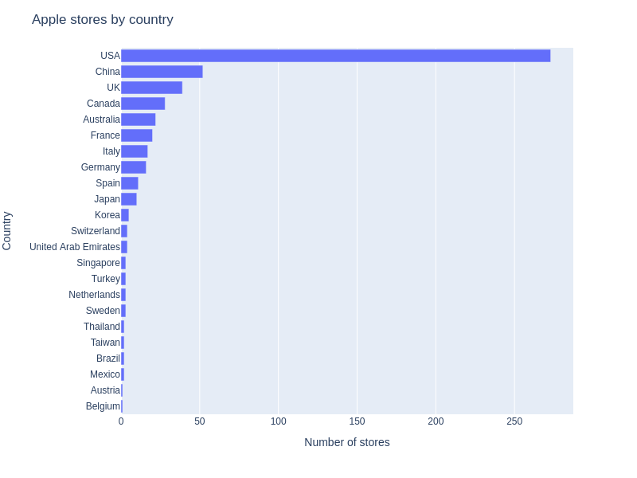
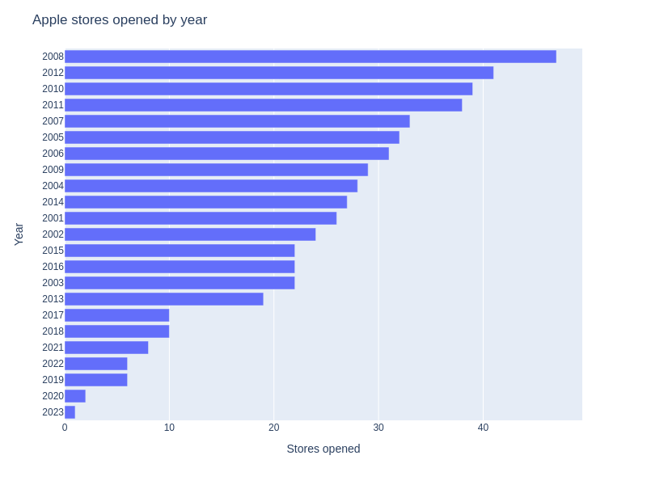
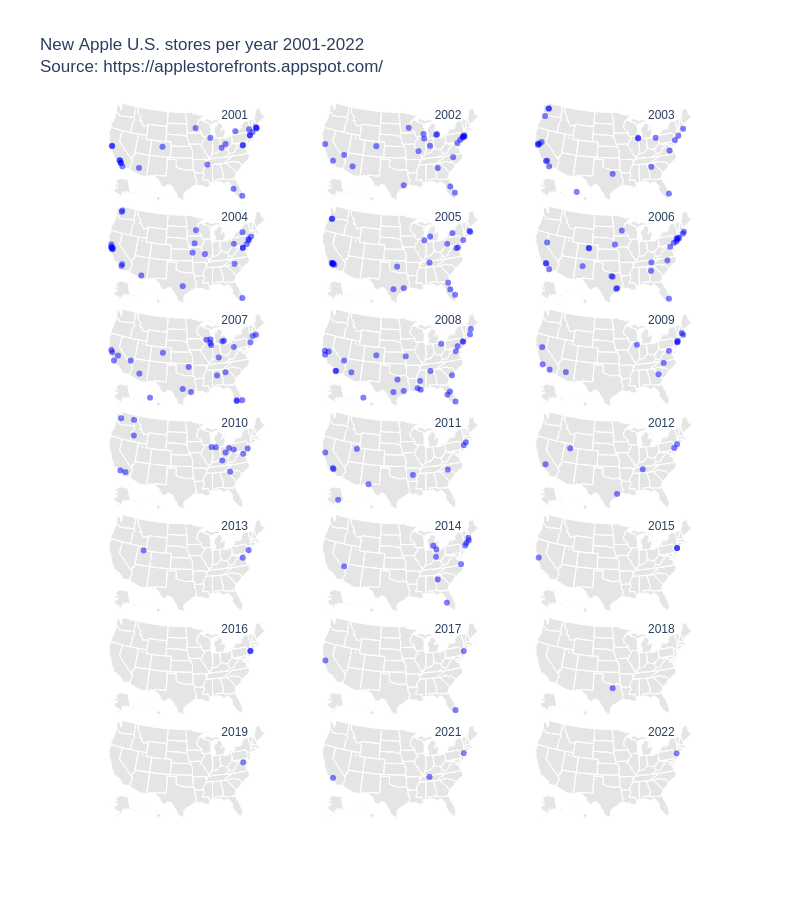
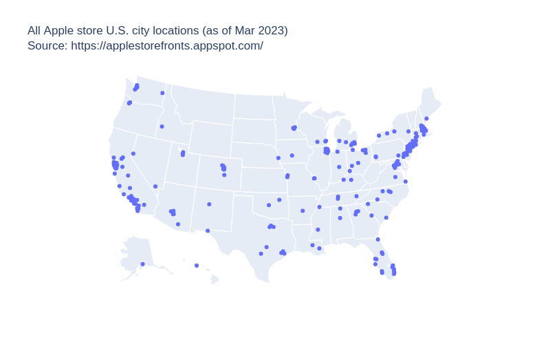

# All Apple store locations

View the notebook: [apple-stores.ipynb](/christianmendoza/apple-store-locations/blob/main/apple-stores.ipynb)

Visualizing geographically all Apple stores in the USA.

Using [BS4](https://beautiful-soup-4.readthedocs.io/en/latest/) to scrape, [pandas](https://pandas.pydata.org/) to clean, augment, and analyze, and [plotly.express](https://plotly.com/python/plotly-express/) to plot the geographic data.

- Store location dataset: [Apple Storefronts](https://applestorefronts.appspot.com/), [dataset](https://applestorefronts.appspot.com/)
- `U.S. City <-> Lat/Long Coords` table: [SimpleMaps](https://simplemaps.com/data), [dataset](https://simplemaps.com/data/us-cities)

